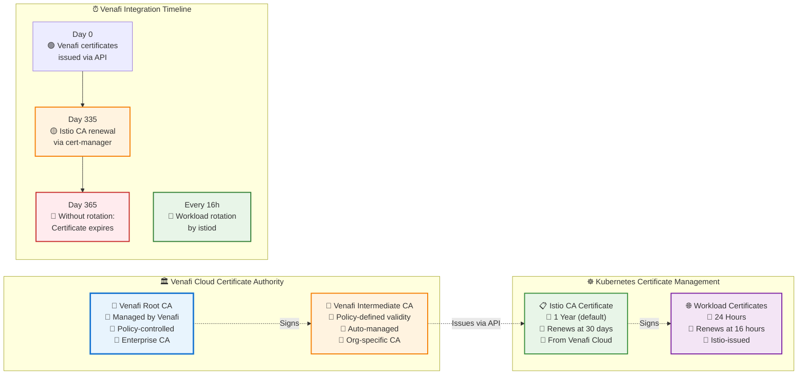

# Venafi + Istio Certificate Management Reference

## Certificate Hierarchy with Venafi Cloud



## Key Configuration Parameters

### Venafi Cloud Issuer

```yaml
apiVersion: cert-manager.io/v1
kind: ClusterIssuer
metadata:
  name: venafi-cloud-issuer
spec:
  venafi:
    cloud:
      apiTokenSecretRef:
        name: venafi-credentials
        key: api-key
      url: https://api.venafi.cloud/v1
    zone: "Your\\Organization\\Project"
```

### Istio CA Certificate from Venafi

```yaml
apiVersion: cert-manager.io/v1
kind: Certificate
metadata:
  name: istio-ca-cert
  namespace: istio-system
spec:
  # Certificate validity period (from Venafi policies)
  duration: 8760h        # 1 year (365 * 24 hours)
  
  # When to start renewal process
  renewBefore: 720h      # 30 days (30 * 24 hours)
  
  # Renewal happens at: duration - renewBefore
  # In this case: 365 days - 30 days = 335 days after issuance
  secretName: cacerts
  isCA: true
  usages:
    - digital signature
    - key encipherment
    - cert sign
  issuerRef:
    name: venafi-cloud-issuer
    kind: ClusterIssuer
    group: cert-manager.io
```

### istio-csr Configuration

```yaml
# ConfigMap for istio-csr
apiVersion: v1
kind: ConfigMap
metadata:
  name: istio-csr-ca
  namespace: istio-system
data:
  issuer-name: venafi-cloud-issuer
  issuer-kind: ClusterIssuer
  issuer-group: cert-manager.io
```

### Istio External CA Configuration

```yaml
apiVersion: install.istio.io/v1alpha1
kind: IstioOperator
metadata:
  name: venafi-istio
spec:
  values:
    pilot:
      env:
        EXTERNAL_CA: true
        PILOT_CERT_PROVIDER: k8s.cluster.local
        ENABLE_CA_SERVER: false
  components:
    pilot:
      k8s:
        env:
          - name: CERT_SIGNER_DOMAIN
            value: venafi-cloud-issuer.cert-manager.io
```

## Certificate Locations

| Component | Certificate Location | Secret Name | Namespace | Source |
|-----------|---------------------|-------------|-----------|--------|
| Venafi Root CA | Venafi Cloud | N/A | N/A | Venafi Cloud |
| Istio CA | `/etc/cacerts` | `cacerts` | `istio-system` | Venafi Cloud |
| Workload Certs | `/etc/certs` | `istio-ca-secret` | `<app-namespace>` | Istio (Venafi chain) |

## Monitoring Commands

### Venafi Certificate Status

```bash
# Check Venafi issuer status
kubectl describe clusterissuer venafi-cloud-issuer

# View Venafi-issued Istio CA certificate
kubectl get certificate istio-ca-cert -n istio-system -o yaml

# Check certificate requests from Venafi
kubectl get certificaterequests -A

# Monitor istio-csr logs
kubectl logs -n istio-system deployment/cert-manager-istio-csr -f
```

### Certificate Chain Validation

```bash
# Verify sidecar certificates show Venafi chain
istioctl proxy-config secret deployment/httpbin -n test-app

# Extract certificate details from sidecar
istioctl pc secret deployment/httpbin.test-app -o json | \
  jq -r '.dynamicActiveSecrets[] | select(.name == "default") | .secret.tlsCertificate.certificateChain.inlineBytes' | \
  base64 -d | openssl x509 -text -noout

# Check certificate issuer (should show Venafi CA)
istioctl pc secret deployment/httpbin.test-app -o json | \
  jq -r '.dynamicActiveSecrets[] | select(.name == "default") | .secret.tlsCertificate.certificateChain.inlineBytes' | \
  base64 -d | openssl x509 -text -noout | grep -A2 "Issuer"
```

### Venafi Cloud Integration Health

```bash
# Check cert-manager logs for Venafi API calls
kubectl logs -n cert-manager deployment/cert-manager -f | grep -i venafi

# Verify Venafi API connectivity
kubectl exec -n cert-manager deployment/cert-manager -- \
  curl -s -H "Authorization: Bearer $(kubectl get secret venafi-credentials -o jsonpath='{.data.api-key}' | base64 -d)" \
  https://api.venafi.cloud/v1/certificates | jq .

# Check certificate policy compliance
kubectl get certificates -A -o custom-columns="NAME:.metadata.name,NAMESPACE:.metadata.namespace,READY:.status.conditions[?(@.type==\"Ready\")].status,ISSUER:.spec.issuerRef.name"
```

## Troubleshooting

### Common Venafi Integration Issues

1. **API Authentication Failures**
   ```bash
   # Check API key secret
   kubectl get secret venafi-credentials -n istio-system
   
   # Test API connectivity
   venctl auth status
   ```

2. **Certificate Issuance Problems**
   ```bash
   # Check issuer status
   kubectl describe clusterissuer venafi-cloud-issuer
   
   # Review certificate request events
   kubectl describe certificate istio-ca-cert -n istio-system
   ```

3. **istio-csr Integration Issues**
   ```bash
   # Check istio-csr configuration
   kubectl get configmap istio-csr-ca -n istio-system -o yaml
   
   # Review istio-csr logs
   kubectl logs -n istio-system deployment/cert-manager-istio-csr --tail=100
   ```

### Certificate Rotation Verification

```bash
# Force certificate renewal for testing
kubectl annotate certificate istio-ca-cert -n istio-system \
  cert-manager.io/issue-temporary-certificate="true" --overwrite

# Monitor certificate rotation
kubectl get certificate istio-ca-cert -n istio-system -w

# Verify new certificate is picked up by workloads
kubectl rollout restart deployment/httpbin -n test-app
kubectl logs -n test-app deployment/httpbin -c istio-proxy --tail=50
```

## Benefits of Venafi Integration

### Security Advantages
- **Enterprise Trust Chain**: Certificates issued by organization's trusted CA
- **Policy Enforcement**: Automatic compliance with corporate security policies
- **Centralized Management**: Single pane of glass for all certificates
- **Audit Trail**: Complete certificate lifecycle visibility

### Operational Benefits
- **Automated Lifecycle**: Hands-off certificate management
- **Compliance Reporting**: Built-in compliance and audit capabilities
- **Risk Reduction**: Prevents certificate-related outages
- **Scalability**: Handles enterprise-scale certificate requirements

### Integration Benefits
- **Seamless Istio Integration**: Works transparently with existing workflows
- **Policy-Driven**: Certificate properties controlled by Venafi policies
- **Multi-Environment**: Consistent certificate management across environments
- **Developer Friendly**: No application code changes required

## Next Steps

1. **Production Deployment**: Plan rollout strategy for production environments
2. **Policy Configuration**: Define certificate policies in Venafi Cloud
3. **Monitoring Setup**: Implement certificate lifecycle monitoring
4. **Team Training**: Educate teams on Venafi + Istio integration
5. **Compliance Validation**: Verify compliance with organizational policies