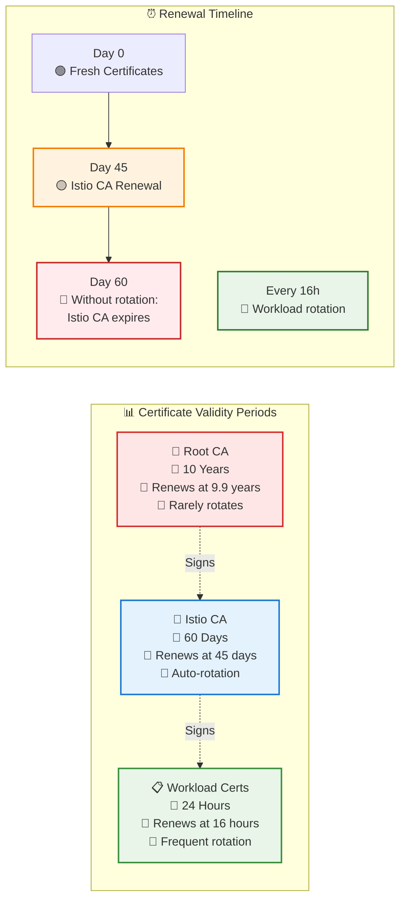

# Certificate Rotation Quick Reference

## Certificate Hierarchy and Timing



## Key Configuration Parameters

### cert-manager Certificate Spec

```yaml
apiVersion: cert-manager.io/v1
kind: Certificate
metadata:
  name: istio-ca
  namespace: istio-system
spec:
  # Certificate validity period
  duration: 1440h        # 60 days (60 * 24 hours)
  
  # When to start renewal process
  renewBefore: 360h      # 15 days (15 * 24 hours)
  
  # Renewal happens at: duration - renewBefore
  # In this case: 60 days - 15 days = 45 days after issuance
```

### Istiod Environment Variables

```yaml
env:
  # Enable automatic CA certificate reload
  - name: AUTO_RELOAD_PLUGIN_CERTS
    value: "true"
  
  # How often to check for new certificates
  - name: PILOT_CERT_CHECK_INTERVAL
    value: "1m"  # Default: 5m
```

## Certificate Locations

| Component | Certificate Location | Secret Name | Namespace |
|-----------|---------------------|-------------|-----------|
| Root CA | `/etc/cert-manager/root-ca` | `root-ca-secret` | `cert-manager` |
| Istio CA | `/etc/cacerts` | `cacerts` | `istio-system` |
| Workload | `/etc/certs` | `istio-ca-secret` | `<app-namespace>` |

## Monitoring Commands

### Certificate Authority Status

```bash
# Check certificate status
kubectl get certificate -A

# View specific certificate details
kubectl describe certificate istio-ca -n istio-system

# Check expiry date (try different certificate keys)
if kubectl get secret cacerts -n istio-system -o json | jq -r '.data."ca-cert.pem"' | base64 -d | openssl x509 -enddate -noout > /dev/null 2>&1; then
  kubectl get secret cacerts -n istio-system -o json | \
    jq -r '.data."ca-cert.pem"' | \
    base64 -d | \
    openssl x509 -enddate -noout
elif kubectl get secret cacerts -n istio-system -o json | jq -r '.data."tls.crt"' | base64 -d | openssl x509 -enddate -noout > /dev/null 2>&1; then
  kubectl get secret cacerts -n istio-system -o json | \
    jq -r '.data."tls.crt"' | \
    base64 -d | \
    openssl x509 -enddate -noout
else
  echo "Certificate format not recognized. Available keys:"
  kubectl get secret cacerts -n istio-system -o json | jq -r '.data | keys[]'
fi

# Monitor renewal events
kubectl get events -n istio-system --field-selector reason=Issuing
```

### Sidecar Certificate Validation

```bash
# View all certificate secrets in a specific workload
istioctl proxy-config secret deployment/httpbin -n test-mtls

# Get detailed certificate information from sidecar
istioctl pc secret deployment/httpbin.test-mtls -o json

# Extract and view certificate details
istioctl pc secret deployment/httpbin.test-mtls -o json | \
  jq -r '.dynamicActiveSecrets[] | select(.name == "default") | .secret.tlsCertificate.certificateChain.inlineBytes' | \
  base64 -d | openssl x509 -text -noout

# Check certificate issuer
istioctl pc secret deployment/httpbin.test-mtls -o json | \
  jq -r '.dynamicActiveSecrets[] | select(.name == "default") | .secret.tlsCertificate.certificateChain.inlineBytes' | \
  base64 -d | openssl x509 -text -noout | grep -A2 "Issuer"

# Get certificate serial (useful for tracking rotation)
istioctl pc secret deployment/httpbin.test-mtls -o json | \
  jq -r '.dynamicActiveSecrets[] | select(.name == "default") | .secret.tlsCertificate.certificateChain.inlineBytes' | \
  base64 -d | openssl x509 -serial -noout

# Check certificate expiry from sidecar
istioctl pc secret deployment/httpbin.test-mtls -o json | \
  jq -r '.dynamicActiveSecrets[] | select(.name == "default") | .secret.tlsCertificate.certificateChain.inlineBytes' | \
  base64 -d | openssl x509 -enddate -noout
```

## Troubleshooting Rotation Issues

### Certificate Not Rotating

1. Check cert-manager logs:
   ```bash
   kubectl logs -n cert-manager deployment/cert-manager
   ```

2. Verify certificate spec:
   ```bash
   kubectl get certificate istio-ca -n istio-system -o yaml
   ```

3. Check renewal status:
   ```bash
   kubectl get certificate istio-ca -n istio-system -o jsonpath='{.status.conditions[?(@.type=="Ready")].message}'
   ```

### Istiod Not Detecting New Certificate

1. Verify environment variable:
   ```bash
   kubectl get deployment istiod -n istio-system -o yaml | grep AUTO_RELOAD_PLUGIN_CERTS
   ```

2. Force reload:
   ```bash
   kubectl rollout restart deployment/istiod -n istio-system
   ```

3. Check logs for certificate loading:
   ```bash
   kubectl logs -n istio-system deployment/istiod | grep -i "loaded ca cert"
   ```

## Production Recommendations

| Certificate | Development | Production |
|-------------|-------------|------------|
| Root CA | 10 years | 10-20 years |
| Istio CA | 60 days | 6-12 months |
| Workload | 24 hours | 24-72 hours |

### Renewal Windows

- Set `renewBefore` to at least 20% of `duration`
- For critical systems, use 30% to allow time for troubleshooting
- Monitor renewal metrics and adjust based on your SLAs