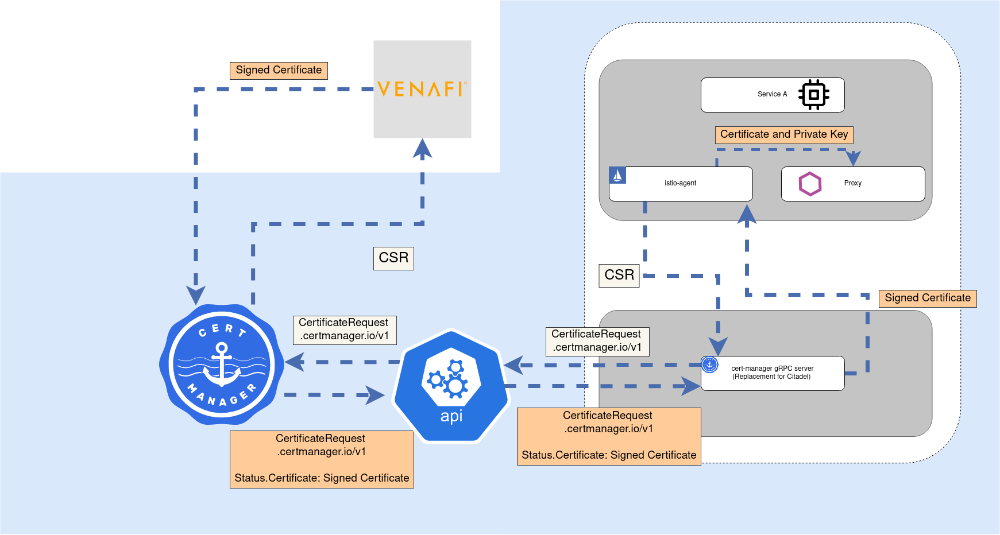

# Venafi Demo
This project demonstrates the simple steps to integrate cert-manager, istio-csr, and Venafi to provide workload certificates for an istio service mesh.  The link below and associated image describe and illustrate the role [cert-manager](https://cert-manager.io/docs/) and [istio-csr](https://github.com/cert-manager/istio-csr) play in accepting & processing sidecar certificate requests, which are brokered to Venafi.

[Blog: cert-manager and Istio integration](https://www.jetstack.io/blog/cert-manager-istio-integration/)

# Installation

## Installing on GetIstio
Follow the steps in the `getmesh` folder [HERE](getmesh/README.md). 

## Installing on Tetrate Service Bridge (TSB)
Follow the steps in the `tsb` folder [HERE](tsb/README.md).