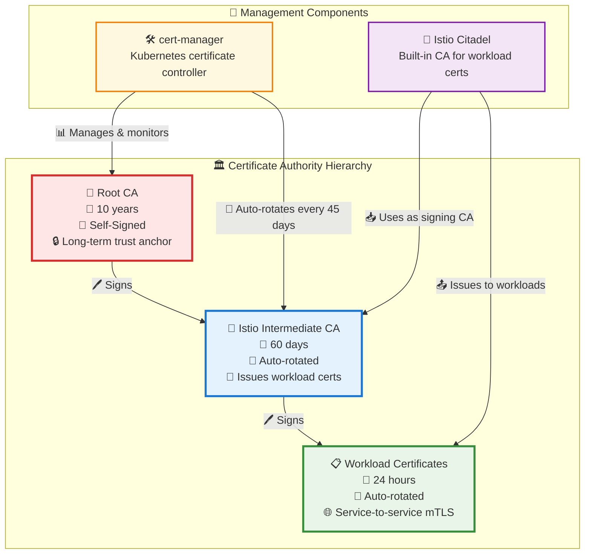
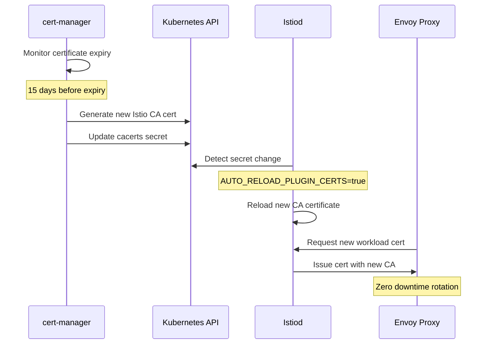
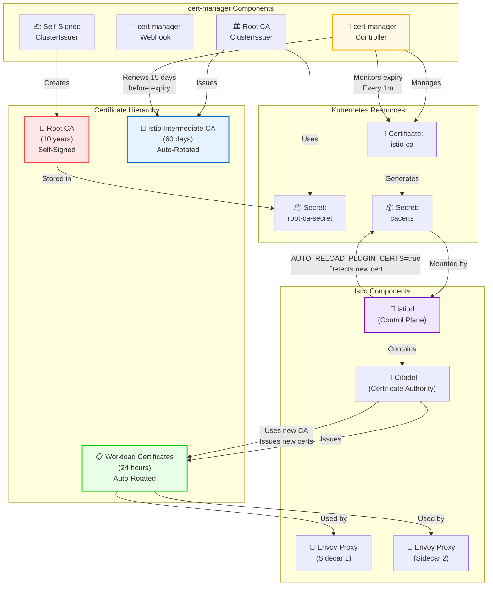
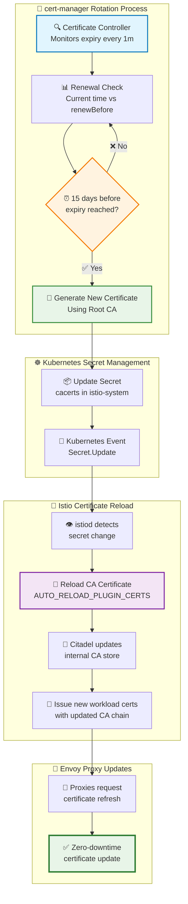

# Tetrate Istio Distribution (TID) Installation Guide with Automated CA Rotation

This comprehensive guide demonstrates how to install Tetrate Istio Distribution (TID) using Helm and configure automated certificate authority (CA) rotation using cert-manager. The solution provides enterprise-grade security with automatic certificate lifecycle management, eliminating manual certificate rotation tasks and reducing the risk of certificate expiry-related outages.

## Table of Contents
1. [Overview](#overview)
2. [Architecture](#architecture)
3. [Prerequisites](#prerequisites)
4. [Quick Start](#quick-start)
5. [Detailed Installation Guide](#detailed-installation-guide)
6. [Understanding CA Rotation](#understanding-ca-rotation)
7. [Automation Scripts](#automation-scripts)
8. [GitHub Actions CI/CD](#github-actions-cicd)
9. [Validation and Testing](#validation-and-testing)
10. [Troubleshooting](#troubleshooting)
11. [Production Considerations](#production-considerations)

## Overview

### What This Guide Provides

- **Automated Certificate Management**: Zero-touch certificate rotation for Istio service mesh
- **Production-Ready Security**: Multi-tier certificate hierarchy with automatic renewal
- **CI/CD Integration**: GitHub Actions workflow for automated testing and validation
- **Complete Automation**: Shell scripts for repeatable deployments

### Key Benefits

1. **Enhanced Security**: Automatic certificate rotation reduces exposure window
2. **Operational Excellence**: Eliminates manual certificate management tasks
3. **Compliance**: Maintains short-lived certificates for zero-trust architecture
4. **Reliability**: Prevents certificate expiry-related outages

## Architecture

### Certificate Hierarchy

The solution implements a three-tier certificate hierarchy:


```mermaid
graph TD
    subgraph "🏛️ Certificate Authority Hierarchy"
        A["🔐 Root CA<br/>📅 10 years<br/>🔑 Self-Signed<br/>🔒 Long-term trust anchor"]
        B["🔑 Istio Intermediate CA<br/>📅 60 days<br/>🔄 Auto-rotated<br/>🎯 Issues workload certs"]
        C["📋 Workload Certificates<br/>📅 24 hours<br/>🔄 Auto-rotated<br/>🌐 Service-to-service mTLS"]
    end
    
    subgraph "🤖 Management Components"
        D["🛠️ cert-manager<br/>Kubernetes certificate controller"]
        E["🎯 Istio Citadel<br/>Built-in CA for workload certs"]
    end
    
    A -->|"🖊️ Signs"| B
    B -->|"🖊️ Signs"| C
    D -->|"📊 Manages & monitors"| A
    D -->|"🔄 Auto-rotates every 45 days"| B
    E -->|"📥 Uses as signing CA"| B
    E -->|"📤 Issues to workloads"| C
    
    style A fill:#ffe6e6,stroke:#d32f2f,stroke-width:3px
    style B fill:#e3f2fd,stroke:#1976d2,stroke-width:3px
    style C fill:#e8f5e8,stroke:#388e3c,stroke-width:3px
    style D fill:#fff8e1,stroke:#f57c00,stroke-width:2px
    style E fill:#f3e5f5,stroke:#7b1fa2,stroke-width:2px
```

### Component Overview

1. **cert-manager**: Kubernetes-native certificate management controller
2. **Tetrate Istio Distribution**: Enterprise-ready Istio distribution
3. **Istio Citadel**: Built-in certificate authority for workload certificates
4. **Envoy Proxy**: Sidecar proxy using mTLS certificates

### How Certificate Rotation Works


```mermaid
sequenceDiagram
    participant CM as cert-manager
    participant K8s as Kubernetes API
    participant Istio as Istiod
    participant Envoy as Envoy Proxy
    
    CM->>CM: Monitor certificate expiry
    Note over CM: 15 days before expiry
    CM->>K8s: Generate new Istio CA cert
    CM->>K8s: Update cacerts secret
    Istio->>K8s: Detect secret change
    Note over Istio: AUTO_RELOAD_PLUGIN_CERTS=true
    Istio->>Istio: Reload new CA certificate
    Envoy->>Istio: Request new workload cert
    Istio->>Envoy: Issue cert with new CA
    Note over Envoy: Zero downtime rotation
```

### Detailed Architecture


```mermaid
graph TB
    subgraph "Certificate Hierarchy"
        RootCA["🔐 Root CA<br/>(10 years)<br/>Self-Signed"]
        IstioCA["🔑 Istio Intermediate CA<br/>(60 days)<br/>Auto-Rotated"]
        WorkloadCert["📋 Workload Certificates<br/>(24 hours)<br/>Auto-Rotated"]
    end

    subgraph "cert-manager Components"
        CM["🤖 cert-manager<br/>Controller"]
        CMWebhook["📡 cert-manager<br/>Webhook"]
        SelfSignedIssuer["✍️ Self-Signed<br/>ClusterIssuer"]
        RootCAIssuer["🏛️ Root CA<br/>ClusterIssuer"]
    end

    subgraph "Istio Components"
        Istiod["🎯 istiod<br/>(Control Plane)"]
        Citadel["🏰 Citadel<br/>(Certificate Authority)"]
        Proxy1["🔄 Envoy Proxy<br/>(Sidecar 1)"]
        Proxy2["🔄 Envoy Proxy<br/>(Sidecar 2)"]
    end

    subgraph "Kubernetes Resources"
        RootSecret["📦 Secret:<br/>root-ca-secret"]
        IstioSecret["📦 Secret:<br/>cacerts"]
        CertResource["📜 Certificate:<br/>istio-ca"]
    end

    %% Certificate Flow
    SelfSignedIssuer -->|Creates| RootCA
    RootCA -->|Stored in| RootSecret
    RootCAIssuer -->|Uses| RootSecret
    RootCAIssuer -->|Issues| IstioCA
    CM -->|Manages| CertResource
    CertResource -->|Generates| IstioSecret
    IstioSecret -->|Mounted by| Istiod
    Istiod -->|Contains| Citadel
    Citadel -->|Issues| WorkloadCert
    WorkloadCert -->|Used by| Proxy1
    WorkloadCert -->|Used by| Proxy2

    %% Rotation Flow
    CM -->|Monitors expiry<br/>Every 1m| CertResource
    CM -->|Renews 15 days<br/>before expiry| IstioCA
    Istiod -->|AUTO_RELOAD_PLUGIN_CERTS=true<br/>Detects new cert| IstioSecret
    Citadel -->|Uses new CA<br/>Issues new certs| WorkloadCert

    style RootCA fill:#ffe6e6,stroke:#ff4444,stroke-width:2px
    style IstioCA fill:#e6f3ff,stroke:#0066cc,stroke-width:2px
    style WorkloadCert fill:#e6ffe6,stroke:#00cc00,stroke-width:2px
    style CM fill:#fff9e6,stroke:#ffaa00,stroke-width:2px
    style Istiod fill:#f0e6ff,stroke:#8800cc,stroke-width:2px
```

The architecture consists of:

1. **Certificate Hierarchy**:
   - Root CA (10 years): Self-signed trust anchor
   - Istio Intermediate CA (60 days): Issues workload certificates
   - Workload Certificates (24 hours): Used for service-to-service mTLS

2. **Automation Components**:
   - cert-manager: Monitors and rotates certificates
   - Istiod: Detects new CA and reloads automatically
   - Envoy Proxies: Receive new certificates without restart

3. **Security Benefits**:
   - Short-lived certificates reduce attack surface
   - Automatic rotation eliminates human error
   - No service disruption during rotation

## Prerequisites

### Required Tools
- Kubernetes cluster (1.27+) or Kind for local development
- Helm (3.6+)
- kubectl configured to access your cluster
- Optional: istioctl for advanced debugging

### System Requirements
- 4 CPU cores minimum
- 8GB RAM minimum
- 20GB free disk space

## Quick Start

For a rapid deployment, use our automation scripts:

```bash
# Clone the repository
git clone <your-repo-url>
cd venafi-demo

# Install TID
./scripts/install-tid.sh

# Setup CA rotation
./scripts/setup-ca-rotation.sh

# Deploy test application
./scripts/deploy-test-app.sh
```

## Detailed Installation Guide

### Install Kind

```bash
# For MacOS
brew install kind

# For Linux
curl -Lo ./kind https://kind.sigs.k8s.io/dl/v0.20.0/kind-linux-amd64
chmod +x ./kind
sudo mv ./kind /usr/local/bin/kind
```

### Create Kind Cluster

```bash
cat <<EOF > kind-config.yaml
kind: Cluster
apiVersion: kind.x-k8s.io/v1alpha4
name: tid-demo
nodes:
- role: control-plane
  kubeadmConfigPatches:
  - |
    kind: InitConfiguration
    nodeRegistration:
      kubeletExtraArgs:
        node-labels: "ingress-ready=true"
  extraPortMappings:
  - containerPort: 80
    hostPort: 80
    protocol: TCP
  - containerPort: 443
    hostPort: 443
    protocol: TCP
EOF

kind create cluster --config kind-config.yaml
```

## TID Installation

### Step 1: Add Tetrate Helm Repository

```bash
helm repo add tetratelabs https://tis.tetrate.io/charts
helm repo update tetratelabs
```

### Step 2: Set Version Variables

```bash
# Check available versions
helm search repo tetratelabs/base --versions

# Set the desired version
export VERSION=1.24.0+tetrate0
export TAG=1.24.0-tetrate0
```

### Step 3: Install Istio Base Components

```bash
# Create istio-system namespace
kubectl create namespace istio-system

# Install base components
helm install istio-base tetratelabs/base \
  -n istio-system \
  --set global.tag=${TAG} \
  --set global.hub="containers.istio.tetratelabs.com" \
  --version ${VERSION}
```

### Step 4: Install Istio Control Plane (istiod)

Create a values file for istiod with CA rotation support:

```bash
cat <<EOF > istiod-values.yaml
global:
  tag: ${TAG}
  hub: "containers.istio.tetratelabs.com"

pilot:
  env:
    # Enable automatic certificate reload
    AUTO_RELOAD_PLUGIN_CERTS: "true"
    # Certificate rotation check interval
    PILOT_CERT_CHECK_INTERVAL: "1m"

meshConfig:
  defaultConfig:
    proxyStatsMatcher:
      inclusionRegexps:
      - ".*circuit_breakers.*"
      - ".*osconfig.*"
      - ".*outlier_detection.*"
      - ".*_retry.*"
EOF

helm install istiod tetratelabs/istiod \
  -n istio-system \
  -f istiod-values.yaml \
  --version ${VERSION}
```

### Step 5: Verify Installation

```bash
# Check Helm releases
helm ls -A

# Verify pods are running
kubectl get pods -n istio-system

# Check Istio version
istioctl version
```

## Understanding CA Rotation

### Why Automated CA Rotation?

1. **Security Best Practices**
   - Short-lived certificates reduce attack window
   - Automatic rotation prevents human error
   - Regular key rotation limits compromise impact

2. **Operational Benefits**
   - No manual intervention required
   - Prevents certificate expiry outages
   - Audit trail of all rotations

3. **How It Works**

The automated CA rotation process involves several components working together:


```mermaid
graph TD
    subgraph "📅 cert-manager Rotation Process"
        A["🔍 Certificate Controller<br/>Monitors expiry every 1m"] 
        B["📊 Renewal Check<br/>Current time vs renewBefore"]
        C{"⏰ 15 days before<br/>expiry reached?"}
        D["🔧 Generate New Certificate<br/>Using Root CA"]
        A --> B
        B --> C
        C -->|❌ No| B
        C -->|✅ Yes| D
    end
    
    subgraph "☸️ Kubernetes Secret Management"
        E["📦 Update Secret<br/>cacerts in istio-system"]
        F["📡 Kubernetes Event<br/>Secret.Update"]
        D --> E
        E --> F
    end
    
    subgraph "🎯 Istio Certificate Reload"
        G["👁️ istiod detects<br/>secret change"]
        H["🔄 Reload CA Certificate<br/>AUTO_RELOAD_PLUGIN_CERTS"]
        I["🏰 Citadel updates<br/>internal CA store"]
        J["📜 Issue new workload certs<br/>with updated CA chain"]
        F --> G
        G --> H
        H --> I
        I --> J
    end
    
    subgraph "🔄 Envoy Proxy Updates"
        K["📨 Proxies request<br/>certificate refresh"]
        L["✅ Zero-downtime<br/>certificate update"]
        J --> K
        K --> L
    end

    style A fill:#e1f5fe,stroke:#0277bd,stroke-width:2px
    style C fill:#fff3e0,stroke:#f57c00,stroke-width:2px
    style D fill:#e8f5e8,stroke:#388e3c,stroke-width:2px
    style H fill:#f3e5f5,stroke:#7b1fa2,stroke-width:2px
    style L fill:#e8f5e8,stroke:#2e7d32,stroke-width:3px
```

### Certificate Lifecycle

| Certificate Type | Duration | Renewal Window | Purpose |
|-----------------|----------|----------------|---------|
| Root CA | 10 years | 30 days | Trust anchor, rarely rotates |
| Istio CA | 60 days | 15 days | Issues workload certificates |
| Workload Cert | 24 hours | 8 hours | Service-to-service mTLS |

## Automated CA Rotation Setup

### Step 1: Install cert-manager

```bash
kubectl apply -f https://github.com/cert-manager/cert-manager/releases/download/v1.13.3/cert-manager.yaml

# Wait for cert-manager to be ready
kubectl wait --for=condition=ready pod -l app.kubernetes.io/instance=cert-manager -n cert-manager --timeout=180s
```

### Step 2: Create Self-Signed Root CA

```bash
cat <<EOF > cert-manager-ca.yaml
---
# Self-signed root CA issuer
apiVersion: cert-manager.io/v1
kind: ClusterIssuer
metadata:
  name: selfsigned-issuer
spec:
  selfSigned: {}
---
# Root CA Certificate
apiVersion: cert-manager.io/v1
kind: Certificate
metadata:
  name: root-ca
  namespace: cert-manager
spec:
  isCA: true
  commonName: root-ca
  secretName: root-ca-secret
  duration: 87600h # 10 years
  renewBefore: 720h # 30 days
  privateKey:
    algorithm: RSA
    encoding: PKCS1
    size: 4096
  issuerRef:
    name: selfsigned-issuer
    kind: ClusterIssuer
    group: cert-manager.io
---
# Root CA Issuer
apiVersion: cert-manager.io/v1
kind: ClusterIssuer
metadata:
  name: root-ca-issuer
spec:
  ca:
    secretName: root-ca-secret
EOF

kubectl apply -f cert-manager-ca.yaml
```

### Step 3: Create Istio Intermediate CA

```bash
cat <<EOF > istio-ca.yaml
---
# Istio Intermediate CA Certificate
apiVersion: cert-manager.io/v1
kind: Certificate
metadata:
  name: istio-ca
  namespace: istio-system
spec:
  isCA: true
  commonName: istio-ca
  secretName: cacerts
  duration: 1440h # 60 days
  renewBefore: 360h # 15 days before expiry
  privateKey:
    algorithm: RSA
    encoding: PKCS1
    size: 4096
  issuerRef:
    name: root-ca-issuer
    kind: ClusterIssuer
    group: cert-manager.io
---
# Istio CA Issuer
apiVersion: cert-manager.io/v1
kind: Issuer
metadata:
  name: istio-ca-issuer
  namespace: istio-system
spec:
  ca:
    secretName: cacerts
EOF

kubectl apply -f istio-ca.yaml
```

### Step 4: Configure Automatic Rotation

```bash
# Restart istiod to pick up the new CA
kubectl rollout restart deployment/istiod -n istio-system

# Verify CA is loaded
kubectl logs -n istio-system deployment/istiod | grep -i "ca cert"
```

### Understanding the Configuration

#### Key Environment Variables

```yaml
pilot:
  env:
    # Enables automatic reloading of CA certificates
    AUTO_RELOAD_PLUGIN_CERTS: "true"
    
    # How often to check for certificate changes (default: 5m)
    PILOT_CERT_CHECK_INTERVAL: "1m"
```

#### cert-manager Certificate Resource

```yaml
apiVersion: cert-manager.io/v1
kind: Certificate
metadata:
  name: istio-ca
  namespace: istio-system
spec:
  # Certificate details
  duration: 1440h      # Total validity period (60 days)
  renewBefore: 360h    # Start renewal 15 days before expiry
  
  # This creates/updates the 'cacerts' secret that Istio expects
  secretName: cacerts
  
  # Required fields for Istio CA
  isCA: true
  commonName: istio-ca
```

### Step 5: Create Test Application with mTLS

```bash
cat <<EOF > test-app.yaml
apiVersion: v1
kind: Namespace
metadata:
  name: test-mtls
  labels:
    istio-injection: enabled
---
apiVersion: apps/v1
kind: Deployment
metadata:
  name: httpbin
  namespace: test-mtls
spec:
  replicas: 1
  selector:
    matchLabels:
      app: httpbin
  template:
    metadata:
      labels:
        app: httpbin
    spec:
      containers:
      - image: docker.io/kennethreitz/httpbin
        name: httpbin
        ports:
        - containerPort: 80
---
apiVersion: v1
kind: Service
metadata:
  name: httpbin
  namespace: test-mtls
spec:
  ports:
  - name: http
    port: 8000
    targetPort: 80
  selector:
    app: httpbin
---
apiVersion: security.istio.io/v1beta1
kind: PeerAuthentication
metadata:
  name: default
  namespace: test-mtls
spec:
  mtls:
    mode: STRICT
EOF

kubectl apply -f test-app.yaml
```

## Automation Scripts

The repository includes three main automation scripts:

### 1. install-tid.sh
- Installs Tetrate Istio Distribution
- Configures automatic certificate reload
- Sets up control plane and gateway

### 2. setup-ca-rotation.sh
- Installs cert-manager
- Creates certificate hierarchy
- Configures automatic rotation

### 3. deploy-test-app.sh
- Deploys sample application
- Enables strict mTLS
- Provides testing commands

## GitHub Actions CI/CD

The included GitHub Actions workflow (`.github/workflows/tid-validation.yml`) provides:

- **Automated Testing**: Validates the entire setup on each commit
- **Kind Cluster**: Creates ephemeral Kubernetes cluster for testing
- **End-to-End Validation**: Tests TID installation, CA rotation, and mTLS
- **Failure Diagnostics**: Collects logs and debugging information

### Workflow Triggers

```yaml
on:
  push:
    branches: [ main ]
  pull_request:
    branches: [ main ]
  workflow_dispatch:  # Manual trigger
```

## Validation and Testing

### Verify Certificate Rotation

```bash
# Check current certificates
kubectl get certificate -n istio-system istio-ca -o yaml

# Monitor certificate renewal
kubectl describe certificate istio-ca -n istio-system

# Check certificate expiry
kubectl get secret cacerts -n istio-system -o json | \
  jq -r '.data."ca-cert.pem"' | \
  base64 -d | \
  openssl x509 -text -noout | \
  grep -A2 "Validity"
```

### Test mTLS Communication

```bash
# Deploy a client pod
kubectl run curl --image=curlimages/curl -n test-mtls --restart=Never --rm -i --tty -- sh

# Inside the pod, test mTLS
curl http://httpbin:8000/headers
```

### Monitoring Certificate Rotation

```bash
# Watch certificate status
watch -n 30 'kubectl get certificate -A'

# View rotation events
kubectl describe certificate istio-ca -n istio-system

# Check next renewal time
kubectl get certificate istio-ca -n istio-system -o jsonpath='{.status.renewalTime}'
```

### Verifying mTLS Between Services

```bash
# Check if mTLS is enabled
istioctl authn tls-check deployment/httpbin -n test-mtls

# View certificate chain
istioctl proxy-config secret deployment/httpbin -n test-mtls -o json | \
  jq '.dynamicActiveSecrets[0].secret.tlsCertificate.certificateChain.inlineBytes' -r | \
  base64 -d | openssl x509 -text -noout
```

## Troubleshooting

### Common Issues

1. **Certificate not rotating**
   - Check cert-manager logs: `kubectl logs -n cert-manager deployment/cert-manager`
   - Verify AUTO_RELOAD_PLUGIN_CERTS is set: `kubectl get deployment istiod -n istio-system -o yaml | grep AUTO_RELOAD`

2. **mTLS not working**
   - Check PeerAuthentication: `kubectl get peerauthentication -A`
   - Verify sidecar injection: `kubectl get pods -n test-mtls -o yaml | grep istio-proxy`

3. **Istiod not picking up new CA**
   - Force restart: `kubectl rollout restart deployment/istiod -n istio-system`
   - Check logs: `kubectl logs -n istio-system deployment/istiod | grep -i cert`

### Useful Commands

```bash
# Check Istio configuration
istioctl analyze -A

# View proxy configuration
istioctl proxy-config secret deployment/httpbin -n test-mtls

# Check certificate chain
istioctl proxy-config secret deployment/httpbin -n test-mtls -o json | \
  jq -r '.dynamicActiveSecrets[0].secret.tlsCertificate.certificateChain.inlineBytes' | \
  base64 -d | \
  openssl x509 -text -noout
```

## Production Considerations

### Certificate Rotation Timing

For production environments, consider adjusting certificate durations:

```yaml
# Production-recommended settings
spec:
  duration: 8760h     # 1 year for Istio CA
  renewBefore: 720h   # 30 days before expiry
```

### High Availability

1. **cert-manager HA**:
   ```bash
   helm upgrade cert-manager jetstack/cert-manager \
     --set webhook.replicas=3 \
     --set cainjector.replicas=2
   ```

2. **Istiod HA**:
   ```bash
   helm upgrade istiod tetratelabs/istiod \
     --set pilot.autoscaleMin=2 \
     --set pilot.autoscaleMax=5
   ```

### Monitoring and Alerting

1. **Certificate Expiry Alerts**:
   ```yaml
   # Prometheus rule example
   - alert: CertificateExpiringSoon
     expr: certmanager_certificate_expiration_timestamp_seconds - time() < 7 * 86400
     annotations:
       summary: "Certificate {{ $labels.name }} expires in less than 7 days"
   ```

2. **Rotation Failure Detection**:
   - Monitor cert-manager logs for errors
   - Set up alerts for failed renewal attempts
   - Track certificate age metrics

### Backup and Recovery

1. **Backup Root CA**:
   ```bash
   kubectl get secret root-ca-secret -n cert-manager -o yaml > root-ca-backup.yaml
   ```

2. **Disaster Recovery**:
   - Document root CA recovery procedure
   - Test CA restoration in non-production
   - Maintain offline root CA backup

## Clean Up

```bash
# Remove test application
kubectl delete namespace test-mtls

# Remove Istio
helm uninstall istio-ingress -n istio-ingress
helm uninstall istiod -n istio-system
helm uninstall istio-base -n istio-system

# Remove namespaces
kubectl delete namespace istio-ingress
kubectl delete namespace istio-system

# Remove cert-manager (if desired)
kubectl delete -f https://github.com/cert-manager/cert-manager/releases/download/v1.13.3/cert-manager.yaml

# Delete Kind cluster
kind delete cluster --name tid-demo
```

## Summary

This guide provides a production-ready solution for automated certificate management in Istio service mesh using:

- **Tetrate Istio Distribution**: Enterprise-grade Istio with long-term support
- **cert-manager**: Kubernetes-native certificate lifecycle management
- **Automated Rotation**: Zero-touch certificate renewal with no downtime
- **CI/CD Integration**: GitHub Actions for continuous validation

### Key Takeaways

1. **Security**: Implements defense-in-depth with multi-tier certificate hierarchy
2. **Automation**: Eliminates manual certificate management tasks
3. **Reliability**: Prevents certificate-related outages
4. **Compliance**: Supports zero-trust architecture requirements

### Next Steps

- Review [production considerations](#production-considerations) for enterprise deployments
- Implement monitoring and alerting for certificate lifecycle
- Consider integration with external certificate authorities (Venafi, HashiCorp Vault)
- Test disaster recovery procedures

### Resources

- [Tetrate Istio Distribution Documentation](https://docs.tetrate.io/istio-subscription/)
- [cert-manager Documentation](https://cert-manager.io/docs/)
- [Istio Security Best Practices](https://istio.io/latest/docs/ops/best-practices/security/)

### Contributing

Feel free to submit issues or pull requests to improve this guide.