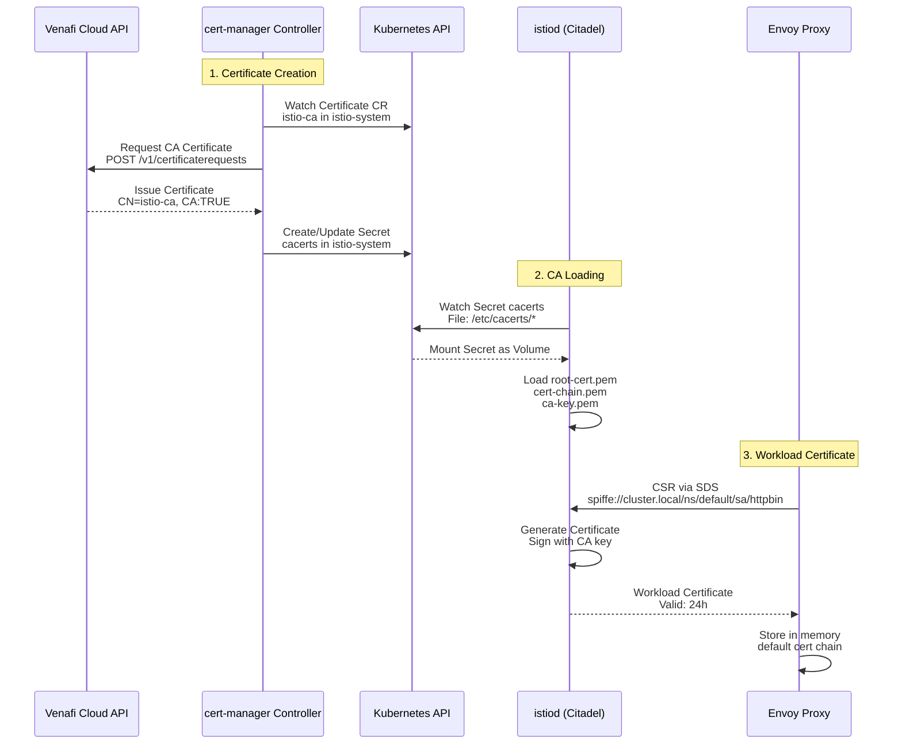
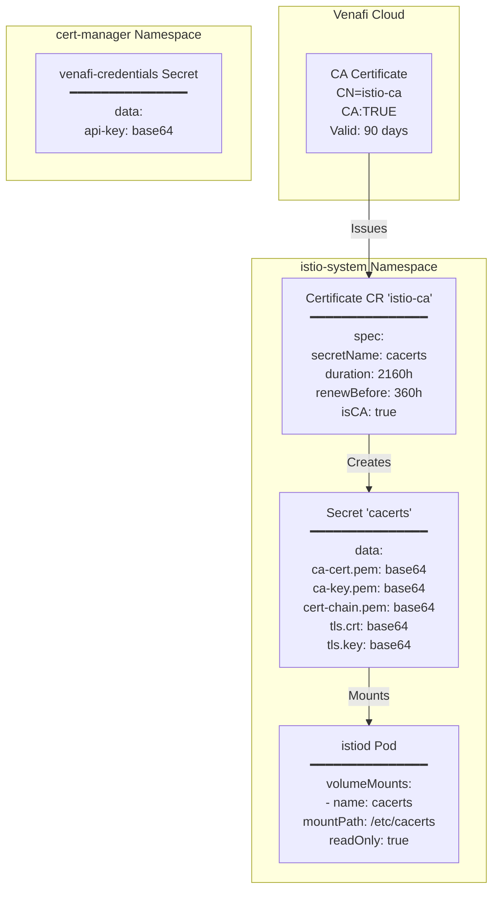
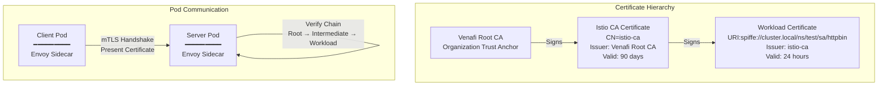
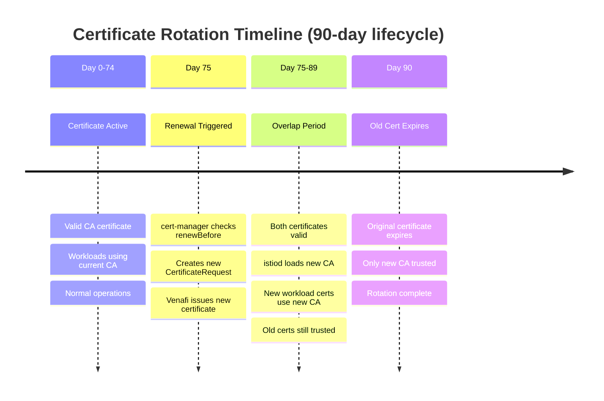
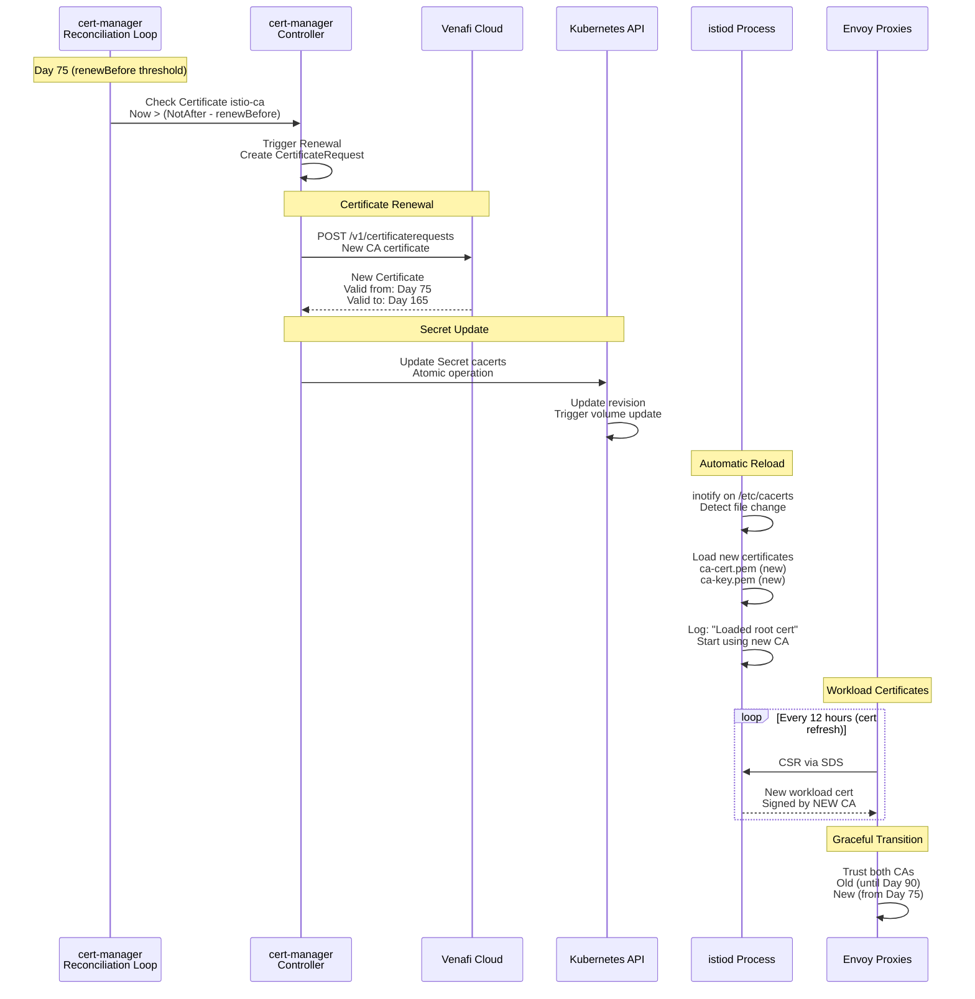

# Venafi + Istio CA Rotation

Automated Istio CA certificate lifecycle management using cert-manager and Venafi Cloud.

## Quick Start

```bash
# Prerequisites
export VENAFI_API_KEY="your-api-key"
export VENAFI_ZONE="Your\\Organization\\Project"

# Install
./scripts/install-cert-manager.sh
./scripts/setup-venafi-ca.sh
./scripts/install-istio.sh
./scripts/verify-setup.sh
```

## Architecture

### Certificate Issuance Flow


```mermaid
sequenceDiagram
    participant Venafi as Venafi Cloud API
    participant CM as cert-manager Controller
    participant K8s as Kubernetes API
    participant Istiod as istiod (Citadel)
    participant Envoy as Envoy Proxy

    Note over CM: 1. Certificate Creation
    CM->>K8s: Watch Certificate CR<br/>istio-ca in istio-system
    CM->>Venafi: Request CA Certificate<br/>POST /v1/certificaterequests
    Venafi-->>CM: Issue Certificate<br/>CN=istio-ca, CA:TRUE
    CM->>K8s: Create/Update Secret<br/>cacerts in istio-system

    Note over Istiod: 2. CA Loading
    Istiod->>K8s: Watch Secret cacerts<br/>File: /etc/cacerts/*
    K8s-->>Istiod: Mount Secret as Volume
    Istiod->>Istiod: Load root-cert.pem<br/>cert-chain.pem<br/>ca-key.pem

    Note over Envoy: 3. Workload Certificate
    Envoy->>Istiod: CSR via SDS<br/>spiffe://cluster.local/ns/default/sa/httpbin
    Istiod->>Istiod: Generate Certificate<br/>Sign with CA key
    Istiod-->>Envoy: Workload Certificate<br/>Valid: 24h
    Envoy->>Envoy: Store in memory<br/>default cert chain
```

### Certificate Files and Secrets


```mermaid
graph TB
    subgraph "Venafi Cloud"
        VCA[CA Certificate<br/>CN=istio-ca<br/>CA:TRUE<br/>Valid: 90 days]
    end

    subgraph "cert-manager Namespace"
        VSecret[venafi-credentials Secret<br/>━━━━━━━━━━━━━━━<br/>data:<br/>  api-key: base64]
    end

    subgraph "istio-system Namespace"
        CACert[Certificate CR 'istio-ca'<br/>━━━━━━━━━━━━━━━<br/>spec:<br/>  secretName: cacerts<br/>  duration: 2160h<br/>  renewBefore: 360h<br/>  isCA: true]
        
        CASecret[Secret 'cacerts'<br/>━━━━━━━━━━━━━━━<br/>data:<br/>  ca-cert.pem: base64<br/>  ca-key.pem: base64<br/>  cert-chain.pem: base64<br/>  tls.crt: base64<br/>  tls.key: base64]
        
        IstiodPod[istiod Pod<br/>━━━━━━━━━━━━━━━<br/>volumeMounts:<br/>- name: cacerts<br/>  mountPath: /etc/cacerts<br/>  readOnly: true]
    end

    VCA -->|Issues| CACert
    CACert -->|Creates| CASecret
    CASecret -->|Mounts| IstiodPod
```

### mTLS Certificate Chain


```mermaid
graph TD
    subgraph "Certificate Hierarchy"
        Root[Venafi Root CA<br/>Organization Trust Anchor]
        Intermediate[Istio CA Certificate<br/>CN=istio-ca<br/>Issuer: Venafi Root CA<br/>Valid: 90 days]
        Workload[Workload Certificate<br/>URI:spiffe://cluster.local/ns/test/sa/httpbin<br/>Issuer: istio-ca<br/>Valid: 24 hours]
    end

    subgraph "Pod Communication"
        ClientPod[Client Pod<br/>━━━━━━━━━<br/>Envoy Sidecar]
        ServerPod[Server Pod<br/>━━━━━━━━━<br/>Envoy Sidecar]
    end

    Root -->|Signs| Intermediate
    Intermediate -->|Signs| Workload
    ClientPod -->|mTLS Handshake<br/>Present Certificate| ServerPod
    ServerPod -->|Verify Chain<br/>Root → Intermediate → Workload| ServerPod
```

## Components

| Component | Version | Purpose |
|-----------|---------|---------|
| cert-manager | v1.18.2 | Certificate lifecycle management |
| Istio | 1.25.2 | Service mesh (auto-reloads certificates) |
| Venafi Cloud | Latest | Enterprise certificate authority |

## Configuration

### Venafi Issuer
```yaml
apiVersion: cert-manager.io/v1
kind: ClusterIssuer
metadata:
  name: venafi-issuer
spec:
  venafi:
    zone: "$VENAFI_ZONE"
    cloud:
      apiTokenSecretRef:
        name: venafi-credentials
        key: api-key
```

### Istio CA Certificate
```yaml
apiVersion: cert-manager.io/v1
kind: Certificate
metadata:
  name: istio-ca
  namespace: istio-system
spec:
  secretName: cacerts
  duration: 2160h    # 90 days
  renewBefore: 360h  # 15 days
  isCA: true
  commonName: istio-ca
  issuerRef:
    name: venafi-issuer
    kind: ClusterIssuer
```

## Certificate Lifecycle

### Rotation Process Timeline


```mermaid
timeline
    title Certificate Rotation Timeline (90-day lifecycle)
    
    section Day 0-74
        Certificate Active  : Valid CA certificate
                           : Workloads using current CA
                           : Normal operations
    
    section Day 75
        Renewal Triggered  : cert-manager checks renewBefore
                          : Creates new CertificateRequest
                          : Venafi issues new certificate
    
    section Day 75-89
        Overlap Period    : Both certificates valid
                         : istiod loads new CA
                         : New workload certs use new CA
                         : Old certs still trusted
    
    section Day 90
        Old Cert Expires  : Original certificate expires
                         : Only new CA trusted
                         : Rotation complete
```

### Detailed Rotation Sequence


```mermaid
sequenceDiagram
    participant Timer as cert-manager<br/>Reconciliation Loop
    participant CM as cert-manager<br/>Controller
    participant Venafi as Venafi Cloud
    participant K8s as Kubernetes API
    participant Istiod as istiod Process
    participant Envoy as Envoy Proxies

    Note over Timer: Day 75 (renewBefore threshold)
    Timer->>CM: Check Certificate istio-ca<br/>Now > (NotAfter - renewBefore)
    CM->>CM: Trigger Renewal<br/>Create CertificateRequest

    Note over CM,Venafi: Certificate Renewal
    CM->>Venafi: POST /v1/certificaterequests<br/>New CA certificate
    Venafi-->>CM: New Certificate<br/>Valid from: Day 75<br/>Valid to: Day 165
    
    Note over CM,K8s: Secret Update
    CM->>K8s: Update Secret cacerts<br/>Atomic operation
    K8s->>K8s: Update revision<br/>Trigger volume update

    Note over Istiod: Automatic Reload
    Istiod->>Istiod: inotify on /etc/cacerts<br/>Detect file change
    Istiod->>Istiod: Load new certificates<br/>ca-cert.pem (new)<br/>ca-key.pem (new)
    Istiod->>Istiod: Log: "Loaded root cert"<br/>Start using new CA

    Note over Envoy: Workload Certificates
    loop Every 12 hours (cert refresh)
        Envoy->>Istiod: CSR via SDS
        Istiod-->>Envoy: New workload cert<br/>Signed by NEW CA
    end
    
    Note over Envoy: Graceful Transition
    Envoy->>Envoy: Trust both CAs<br/>Old (until Day 90)<br/>New (from Day 75)
```

## Operations

### Monitor Certificate
```bash
# Status
kubectl get certificate istio-ca -n istio-system

# Expiry date
kubectl get certificate istio-ca -n istio-system -o jsonpath='{.status.notAfter}'

# Force renewal (testing)
kubectl annotate certificate istio-ca -n istio-system \
  cert-manager.io/issue-temporary-certificate="true" --overwrite
```

### Troubleshooting
```bash
# Check issuer
kubectl describe clusterissuer venafi-issuer

# cert-manager logs
kubectl logs -n cert-manager deployment/cert-manager

# Istio certificate reload
kubectl logs -n istio-system deployment/istiod | grep -i cert

# Verify sidecar certificates
istioctl pc secret deploy/httpbin -n test

# Extract certificate issuer from sidecar
istioctl pc secret deploy/httpbin -n test --output json | \
  jq -r '.dynamicActiveSecrets[0].secret.tlsCertificate.certificateChain.inlineBytes' | \
  base64 -d | openssl x509 -issuer -noout

# Test mTLS with Alpine curl
kubectl run -n test curl-test --rm -i --image curlimages/curl --restart=Never -- \
  curl -s httpbin:8000/headers
```

## Technical Details

### Secret Structure

The `cacerts` secret in `istio-system` contains:

| File | Purpose | Format |
|------|---------|--------|
| `ca-cert.pem` | Root certificate | PEM-encoded X.509 |
| `ca-key.pem` | Private key for CA | PEM-encoded RSA/ECDSA |
| `cert-chain.pem` | Full certificate chain | PEM-encoded chain |
| `tls.crt` | Same as ca-cert.pem | PEM-encoded X.509 |
| `tls.key` | Same as ca-key.pem | PEM-encoded key |

### istiod Certificate Loading

```yaml
# istiod deployment volume configuration
volumes:
- name: cacerts
  secret:
    secretName: cacerts
    items:
    - key: ca-cert.pem
      path: ca-cert.pem
    - key: ca-key.pem
      path: ca-key.pem
    - key: cert-chain.pem
      path: cert-chain.pem
```

### Workload Certificate Details

```bash
# Example workload certificate
Subject: URI=spiffe://cluster.local/ns/test/sa/httpbin
Issuer: CN=istio-ca
Validity:
  Not Before: Nov 20 10:00:00 2024 GMT
  Not After: Nov 21 10:00:00 2024 GMT (24h)
X509v3 extensions:
  X509v3 Key Usage: Digital Signature, Key Encipherment
  X509v3 Extended Key Usage: TLS Web Server Authentication, TLS Web Client Authentication
  X509v3 Subject Alternative Name: URI:spiffe://cluster.local/ns/test/sa/httpbin
```

## Testing

For CI/testing without Venafi:
```bash
./scripts/install-cert-manager.sh
./scripts/setup-self-signed-ca.sh  # Instead of setup-venafi-ca.sh
./scripts/install-istio.sh
./scripts/verify-setup.sh
```

## References

- [Tetrate CA Rotation Blog](https://tetrate.io/blog/automate-istio-ca-rotation-in-production-at-scale)
- [cert-manager Venafi Docs](https://cert-manager.io/docs/configuration/venafi/)
- [Istio Certificate Management](https://istio.io/latest/docs/tasks/security/cert-management/)