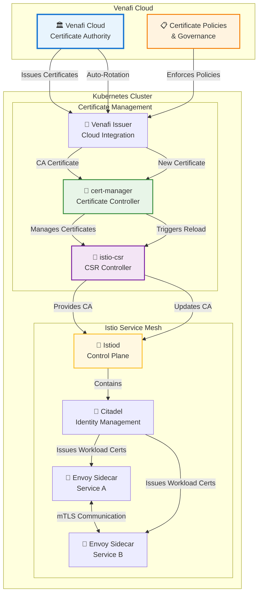
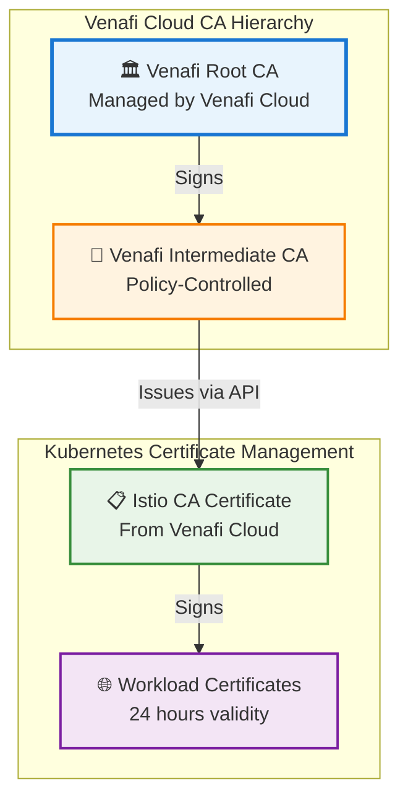

# Venafi Cloud + Istio Service Mesh Integration Demo

This repository demonstrates how to integrate **Venafi Cloud** with **Istio Service Mesh** for automated certificate lifecycle management using **istio-csr** and **cert-manager**. The solution provides enterprise-grade certificate management with automated issuance, rotation, and compliance for service mesh workloads.

## Table of Contents
1. [Overview](#overview)
2. [Architecture](#architecture)
3. [Prerequisites](#prerequisites)
4. [Quick Start](#quick-start)
5. [Detailed Installation Guide](#detailed-installation-guide)
6. [Understanding Certificate Lifecycle](#understanding-certificate-lifecycle)
7. [Automation Scripts](#automation-scripts)
8. [GitHub Actions CI/CD](#github-actions-cicd)
9. [Validation and Testing](#validation-and-testing)
10. [Troubleshooting](#troubleshooting)
11. [Production Considerations](#production-considerations)

## Overview

### What This Demo Provides

- **Venafi Cloud Integration**: Enterprise certificate management platform
- **Automated Certificate Lifecycle**: Zero-touch certificate issuance and rotation
- **Istio Service Mesh Security**: mTLS communication between workloads
- **Policy Enforcement**: Certificate policies and compliance validation
- **Complete Automation**: Scripts and CI/CD for repeatable deployments

### Key Components

1. **Venafi Cloud**: SaaS platform for certificate lifecycle management
2. **istio-csr**: Certificate signing request controller for Istio
3. **cert-manager**: Kubernetes-native certificate management
4. **Istio Service Mesh**: Service-to-service communication security
5. **venctl**: CLI tool for Venafi Cloud operations

### Benefits

1. **Enterprise Security**: Venafi's proven certificate management platform
2. **Policy Compliance**: Centralized certificate policies and governance
3. **Operational Excellence**: Automated certificate lifecycle management
4. **Zero-Trust Architecture**: Strong service identity and encryption
5. **Observability**: Certificate usage analytics and compliance reporting

## Architecture

### Certificate Flow


```mermaid
graph TD
    subgraph "Venafi Cloud"
        VC["🏛️ Venafi Cloud<br/>Certificate Authority"]
        VCP["📋 Certificate Policies<br/>& Governance"]
    end
    
    subgraph "Kubernetes Cluster"
        subgraph "Certificate Management"
            CM["🤖 cert-manager<br/>Certificate Controller"]
            ICR["🔧 istio-csr<br/>CSR Controller"]
            VI["📡 Venafi Issuer<br/>Cloud Integration"]
        end
        
        subgraph "Istio Service Mesh"
            Istiod["🎯 Istiod<br/>Control Plane"]
            Citadel["🏰 Citadel<br/>Identity Management"]
            Proxy1["🔄 Envoy Sidecar<br/>Service A"]
            Proxy2["🔄 Envoy Sidecar<br/>Service B"]
        end
    end
    
    %% Certificate Flow
    VC -->|Issues Certificates| VI
    VCP -->|Enforces Policies| VI
    VI -->|CA Certificate| CM
    CM -->|Manages Certificates| ICR
    ICR -->|Provides CA| Istiod
    Istiod -->|Contains| Citadel
    Citadel -->|Issues Workload Certs| Proxy1
    Citadel -->|Issues Workload Certs| Proxy2
    Proxy1 <-->|mTLS Communication| Proxy2
    
    %% Rotation Flow
    VC -->|Auto-Rotation| VI
    VI -->|New Certificate| CM
    CM -->|Triggers Reload| ICR
    ICR -->|Updates CA| Istiod
    
    style VC fill:#e8f4fd,stroke:#1976d2,stroke-width:3px
    style VCP fill:#fff3e0,stroke:#f57c00,stroke-width:2px
    style CM fill:#e8f5e8,stroke:#388e3c,stroke-width:2px
    style ICR fill:#f3e5f5,stroke:#7b1fa2,stroke-width:2px
    style Istiod fill:#fff8e1,stroke:#fbc02d,stroke-width:2px
```

### Integration Points

1. **Venafi Cloud → Issuer**: Provides root/intermediate CAs
2. **cert-manager → istio-csr**: Manages certificate lifecycle
3. **istio-csr → Istiod**: Integrates with Istio's certificate management
4. **Istiod → Workloads**: Issues short-lived workload certificates

## Prerequisites

### Required Tools
- Kubernetes cluster (1.27+) or Kind for local development
- `kubectl` configured to access your cluster
- `venctl` CLI tool for Venafi Cloud
- `istioctl` for Istio management
- `helm` (3.6+) for package management

### System Requirements
- 4 CPU cores minimum
- 8GB RAM minimum
- 20GB free disk space

### Venafi Cloud Setup
- Venafi Cloud account with API access
- Service account or API key for authentication
- Certificate Authority configured in Venafi Cloud

## Quick Start

For a rapid deployment, use our automation scripts:

```bash
# Clone the repository
git clone <your-repo-url>
cd venafi-demo

# Set up environment variables
export VENAFI_CLOUD_API_KEY="your-api-key"
export VENAFI_ZONE="your-certificate-zone"

# Install Venafi components
./scripts/install-venafi-components.sh

# Install Istio with Venafi integration
./scripts/install-istio-venafi.sh

# Deploy test application
./scripts/deploy-test-app.sh
```

## Detailed Installation Guide

### Step 1: Install venctl CLI

#### macOS/Linux/WSL
```bash
# Using installer script
curl -sSfL https://dl.venafi.cloud/venctl/latest/installer.sh | bash

# Or using Homebrew
brew install venafi/tap/venctl
```

#### Windows
```powershell
# Using PowerShell
irm https://dl.venafi.cloud/venctl/latest/installer.ps1 | iex
```

### Step 2: Authenticate with Venafi Cloud

```bash
export VENAFI_API_KEY="key"

venctl iam service-accounts registry create --name "My Image Pull Secret" \
  --scopes cert-manager-components,enterprise-venafi-issuer,enterprise-approver-policy,openshift-routes \
  --output dockerconfig \
  --output-file venafi_registry_docker_config.json \
  --validity 365 \
  --api-key $VENAFI_API_KEY
```

### Step 3: Create Kubernetes Namespaces

```bash
kubectl create namespace venafi
kubectl create namespace istio-system
```

### Step 4: Install Venafi Components

```bash
# Generate Kubernetes manifest for Venafi components
venctl components kubernetes manifest generate \
  --region us \
  --cert-manager \
  --istio-csr \
  --default-approver > venafi-components.yaml

# Apply the manifest
ISTIO_TRUST_DOMAIN=cluster.local venctl components kubernetes manifest tool sync --file venafi-components.yaml
```

### Step 5: Configure Venafi Issuer

Create a Venafi Cloud issuer for certificate management:

```bash
cat <<EOF | kubectl apply -f -
apiVersion: cert-manager.io/v1
kind: ClusterIssuer
metadata:
  name: venafi-cloud-issuer
spec:
  venafi:
    cloud:
      apiTokenSecretRef:
        name: venafi-credentials
        key: api-key
      url: https://api.venafi.cloud/v1
    zone: "$VENAFI_ZONE"
EOF
```

### Step 6: Install istio-csr

```bash
# Create ConfigMap for istio-csr configuration
kubectl create configmap istio-csr-ca \
  --namespace=istio-system \
  --from-literal=issuer-name=venafi-cloud-issuer \
  --from-literal=issuer-kind=ClusterIssuer \
  --from-literal=issuer-group=cert-manager.io

# Install istio-csr via Helm
helm repo add jetstack https://charts.jetstack.io
helm install istio-csr jetstack/cert-manager-istio-csr \
  --namespace istio-system \
  --set image.repository=quay.io/jetstack/cert-manager-istio-csr \
  --wait
```

### Step 7: Install Istio with Venafi Integration

```bash
# Create Istio configuration for Venafi integration
cat <<EOF > istio-venafi-config.yaml
apiVersion: install.istio.io/v1alpha1
kind: IstioOperator
metadata:
  namespace: istio-system
spec:
  profile: cert-manager-istio-csr 
  hub: gcr.io/istio-release
  meshConfig:
    # Change the following line to configure the trust domain of the Istio cluster.
    trustDomain: cluster.local 
  values:
    global:
      # The address of the Istio CSR gRPC server
      caAddress: cert-manager-istio-csr.istio-system.svc:443
  components:
    pilot:
      k8s:
        env:
          # Disable istiod CA Sever functionality
        - name: ENABLE_CA_SERVER
          value: "false"
EOF

# Install Istio
istioctl install -f istio-venafi-config.yaml -y
```

### Step 8: Verify Installation

```bash
# Check all components are running
kubectl get pods -n venafi
kubectl get pods -n istio-system

# Verify Venafi issuer
kubectl get clusterissuer venafi-cloud-issuer -o yaml

# Check istio-csr status
kubectl logs -n istio-system deployment/cert-manager-istio-csr
```

## Understanding Certificate Lifecycle

### Certificate Hierarchy with Venafi


```mermaid
graph TD
    subgraph "Venafi Cloud CA Hierarchy"
        VRoot["🏛️ Venafi Root CA<br/>Managed by Venafi Cloud"]
        VIntermediate["🔑 Venafi Intermediate CA<br/>Policy-Controlled"]
    end
    
    subgraph "Kubernetes Certificate Management"
        IstioCA["📋 Istio CA Certificate<br/>From Venafi Cloud"]
        WorkloadCerts["🌐 Workload Certificates<br/>24 hours validity"]
    end
    
    VRoot -->|Signs| VIntermediate
    VIntermediate -->|Issues via API| IstioCA
    IstioCA -->|Signs| WorkloadCerts
    
    style VRoot fill:#e8f4fd,stroke:#1976d2,stroke-width:3px
    style VIntermediate fill:#fff3e0,stroke:#f57c00,stroke-width:2px
    style IstioCA fill:#e8f5e8,stroke:#388e3c,stroke-width:2px
    style WorkloadCerts fill:#f3e5f5,stroke:#7b1fa2,stroke-width:2px
```

### Key Advantages

1. **Centralized Policy**: All certificates follow Venafi Cloud policies
2. **Compliance**: Automated compliance reporting and auditing
3. **Rotation**: Automated certificate renewal based on policies
4. **Visibility**: Complete certificate inventory and usage analytics

## Automation Scripts

The repository includes automation scripts for easy deployment:

### 1. install-venafi-components.sh
- Installs venctl CLI if needed
- Configures Venafi Cloud authentication
- Deploys cert-manager and istio-csr

### 2. install-istio-venafi.sh
- Installs Istio with Venafi integration
- Configures external CA integration
- Sets up certificate signing

### 3. deploy-test-app.sh
- Deploys sample applications
- Enables strict mTLS
- Provides validation commands

## Validation and Testing

### Verify Venafi Integration

```bash
# Check Venafi issuer status
kubectl describe clusterissuer venafi-cloud-issuer

# View certificate requests
kubectl get certificaterequests -A

# Check istio-csr logs
kubectl logs -n istio-system deployment/cert-manager-istio-csr
```

### Validate Sidecar Certificates

> **Note**: Ensure `istioctl` version compatibility with your Istio version.

```bash
# View sidecar certificate secrets
istioctl proxy-config secret deployment/httpbin -n test-app

# Extract and verify certificate chain from Venafi
istioctl pc secret deployment/httpbin.test-app -o json | \
  jq -r '.dynamicActiveSecrets[] | select(.name == "default") | .secret.tlsCertificate.certificateChain.inlineBytes' | \
  base64 -d | openssl x509 -text -noout

# Check certificate issuer (should show Venafi CA)
istioctl pc secret deployment/httpbin.test-app -o json | \
  jq -r '.dynamicActiveSecrets[] | select(.name == "default") | .secret.tlsCertificate.certificateChain.inlineBytes' | \
  base64 -d | openssl x509 -text -noout | grep -A2 "Issuer"
```

### Test mTLS Communication

```bash
# Deploy test applications
kubectl label namespace test-app istio-injection=enabled
kubectl apply -f examples/test-apps.yaml

# Test communication
kubectl exec -n test-app deployment/curl -- curl -s http://httpbin:8000/headers
```

## GitHub Actions CI/CD

The included GitHub Actions workflow provides:

- **Automated Testing**: Validates the entire setup on each commit
- **Kind Cluster**: Creates ephemeral Kubernetes cluster for testing
- **End-to-End Validation**: Tests Venafi integration, certificate issuance, and mTLS
- **Certificate Rotation**: Validates automated certificate lifecycle

## Troubleshooting

### Common Issues

1. **Venafi Authentication Failures**
   - Verify API key: `venctl auth status`
   - Check network connectivity to Venafi Cloud
   - Validate zone configuration

2. **Certificate Issuance Problems**
   - Check issuer status: `kubectl describe clusterissuer venafi-cloud-issuer`
   - Review cert-manager logs: `kubectl logs -n venafi deployment/cert-manager`
   - Validate istio-csr: `kubectl logs -n istio-system deployment/cert-manager-istio-csr`

3. **mTLS Communication Failures**
   - Verify sidecar injection: `kubectl get pods -n test-app -o yaml | grep istio-proxy`
   - Check PeerAuthentication: `kubectl get peerauthentication -A`
   - Validate certificates: `istioctl pc secret deployment/httpbin.test-app`

## Production Considerations

### Security Best Practices

1. **API Key Management**: Use Kubernetes secrets for Venafi credentials
2. **Network Policies**: Restrict access to Venafi components
3. **RBAC**: Implement least-privilege access controls
4. **Monitoring**: Set up alerts for certificate expiration and issuance failures

### High Availability

1. **Multi-region**: Deploy across multiple availability zones
2. **Backup**: Regular backup of certificate configurations
3. **Disaster Recovery**: Document recovery procedures for Venafi integration

### Monitoring and Alerting

```bash
# Monitor certificate expiration
kubectl get certificates -A -o custom-columns="NAME:.metadata.name,NAMESPACE:.metadata.namespace,READY:.status.conditions[?(@.type==\"Ready\")].status,AGE:.metadata.creationTimestamp"

# Check Venafi component health
kubectl get pods -n venafi -o wide
```

## Resources

- [Venafi Cloud Documentation](https://docs.venafi.cloud/)
- [cert-manager Documentation](https://cert-manager.io/docs/)
- [istio-csr Documentation](https://github.com/cert-manager/istio-csr)
- [Istio Security Best Practices](https://istio.io/latest/docs/ops/best-practices/security/)

## Contributing

Feel free to submit issues or pull requests to improve this Venafi + Istio integration demo.