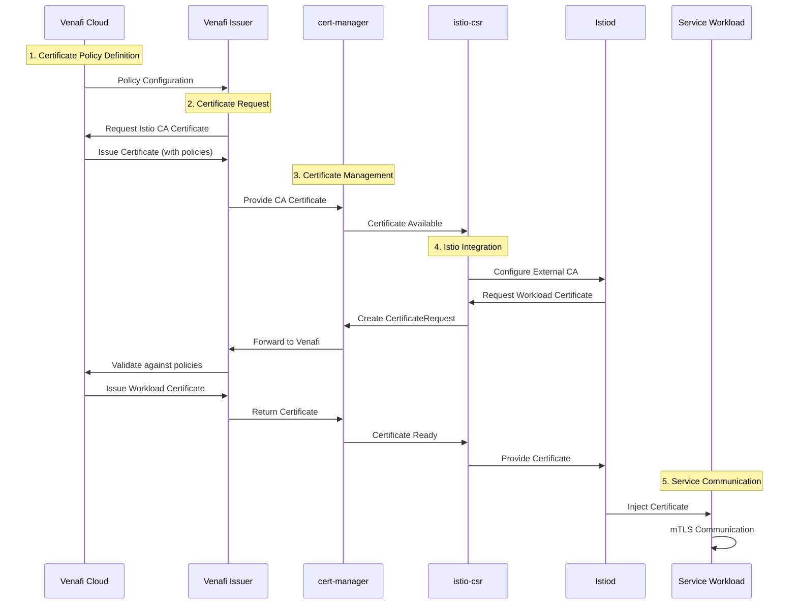

# Venafi Cloud + Istio Integration Guide

This document explains the key components and benefits of integrating Venafi Cloud with Istio Service Mesh for enterprise certificate management.

## Overview

This demo showcases how **Venafi Cloud** serves as the certificate authority for **Istio Service Mesh**, providing enterprise-grade certificate lifecycle management with policy enforcement and compliance reporting.

## Key Components

### 1. Venafi Cloud
- **SaaS Certificate Management Platform**: Centralized certificate authority and policy management
- **Policy Enforcement**: Ensures all certificates comply with organizational security policies  
- **Compliance Reporting**: Provides detailed analytics and audit trails
- **API Integration**: RESTful APIs for automated certificate operations

### 2. venctl CLI
- **Command-line tool** for Venafi Cloud operations
- **Installation**: `curl -sSfL https://dl.venafi.cloud/venctl/latest/installer.sh | bash`
- **Authentication**: Manages API keys and cloud connectivity
- **Component Management**: Deploys Kubernetes integrations

### 3. cert-manager
- **Kubernetes-native certificate management**
- **Venafi Integration**: Custom issuer for Venafi Cloud connectivity
- **Automatic Renewal**: Handles certificate lifecycle automatically
- **CRD-based**: Uses Kubernetes custom resources for configuration

### 4. istio-csr
- **Certificate Signing Request controller** for Istio
- **External CA Integration**: Connects Istio to external certificate authorities
- **Seamless Integration**: Works transparently with existing Istio workflows
- **Trust Domain Management**: Handles service identity and trust boundaries

## Architecture Benefits

### Traditional Istio CA vs Venafi Integration

| Aspect | Traditional Istio CA | Venafi + Istio |
|--------|---------------------|----------------|
| **CA Management** | Self-signed root CA | Enterprise CA from Venafi Cloud |
| **Policy Enforcement** | None | Centralized policies from Venafi |
| **Compliance** | Manual | Automated reporting and auditing |
| **Certificate Visibility** | Limited to cluster | Global visibility across organization |
| **Rotation Management** | Basic automation | Policy-driven with approval workflows |
| **Trust Chain** | Cluster-local | Enterprise trust hierarchy |

### Security Advantages

1. **Enterprise Trust**: Certificates are issued by organization's trusted CA hierarchy
2. **Policy Compliance**: All certificates automatically comply with security policies
3. **Audit Trail**: Complete certificate lifecycle tracked in Venafi Cloud
4. **Centralized Management**: Single pane of glass for all certificates
5. **Automated Governance**: Policy violations are automatically prevented

## Integration Flow



## Certificate Lifecycle with Venafi

### 1. Policy Definition
- Define certificate policies in Venafi Cloud console
- Set validity periods, key sizes, allowed usages
- Configure approval workflows if required

### 2. Automatic Issuance
- cert-manager requests certificates via Venafi issuer
- Venafi Cloud validates against policies
- Certificates are issued and stored in Kubernetes secrets

### 3. Deployment and Usage
- istio-csr provides certificates to Istio control plane
- Istiod issues workload certificates following the same trust chain
- Services communicate using Venafi-backed mTLS

### 4. Monitoring and Compliance
- All certificate activities are logged in Venafi Cloud
- Compliance reports are automatically generated
- Certificate inventory is maintained centrally

## Validation Commands

### Verify Venafi Integration
```bash
# Check Venafi issuer status
kubectl describe clusterissuer venafi-cloud-issuer

# View certificate requests
kubectl get certificaterequests -A

# Monitor istio-csr logs
kubectl logs -n istio-system deployment/cert-manager-istio-csr
```

### Validate Certificate Chain
```bash
# View sidecar certificates (should show Venafi CA)
istioctl pc secret deployment/httpbin.test-app -o json | \
  jq -r '.dynamicActiveSecrets[] | select(.name == "default") | .secret.tlsCertificate.certificateChain.inlineBytes' | \
  base64 -d | openssl x509 -text -noout | grep -A2 "Issuer"
```

### Test mTLS Communication
```bash
# Verify services can communicate with Venafi certificates
kubectl exec -n test-app deployment/curl -- curl -s http://httpbin:8000/headers
```

## Production Considerations

### Security Best Practices
1. **API Key Management**: Store Venafi API keys in Kubernetes secrets
2. **Network Policies**: Restrict access to certificate management components
3. **RBAC**: Implement least-privilege access to certificate resources
4. **Policy Enforcement**: Define strict certificate policies in Venafi Cloud

### Monitoring and Alerting
1. **Certificate Expiration**: Monitor certificates approaching expiration
2. **Policy Violations**: Alert on any policy compliance issues
3. **Integration Health**: Monitor cert-manager and istio-csr components
4. **Venafi Connectivity**: Ensure continuous connectivity to Venafi Cloud

### High Availability
1. **Component Redundancy**: Deploy multiple replicas of cert-manager and istio-csr
2. **Backup Strategies**: Regular backup of certificate configurations
3. **Disaster Recovery**: Document recovery procedures for Venafi integration

## Benefits Summary

### For Security Teams
- **Centralized Control**: All certificates managed through single platform
- **Policy Enforcement**: Automatic compliance with security policies
- **Audit and Compliance**: Complete certificate lifecycle visibility
- **Risk Reduction**: Enterprise-grade certificate management

### For Platform Teams
- **Automation**: Hands-off certificate lifecycle management
- **Integration**: Seamless integration with existing Istio workflows
- **Scalability**: Handles certificate management at enterprise scale
- **Reliability**: Proven certificate management platform

### For Development Teams
- **Transparency**: No changes to application code required
- **Security**: Automatic mTLS with enterprise certificates
- **Reliability**: Automated certificate renewal prevents outages
- **Compliance**: Applications automatically use compliant certificates

## Next Steps

1. **Deploy the Demo**: Follow the installation scripts to set up the integration
2. **Explore Venafi Cloud**: Examine the certificate inventory and policies
3. **Test Scenarios**: Validate different certificate management scenarios
4. **Production Planning**: Plan rollout strategy for production environments
5. **Training**: Educate teams on the new certificate management workflow