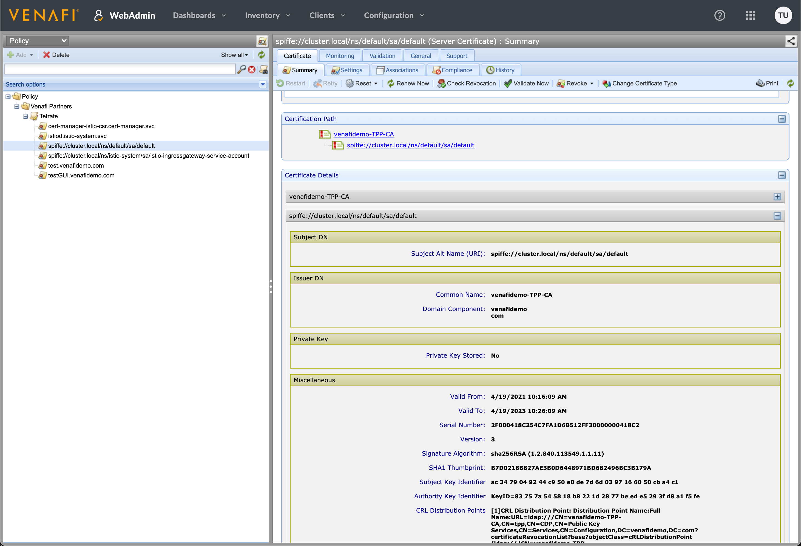

# Venafi Demo
This project demonstrates the simple steps to integrate cert-manager, istio-csr, and Venafi to provide workload certificates for an istio service mesh

# Installation

## Installing on getmesh
Prior to installing ensure you have kubectl, helm, and getmesh CLIs installed.  Additionally, you should already have a provisioned kubernetes cluster.

- `fetch` your desired Istio version utilizing `getmesh fetch`.  You may also list the available version with the `getmesh list` command
```bash
$ getmesh fetch --version 1.8.5 --flavor tetrate --flavor-version 0

Downloading 1.8.5-tetrate-v0 from https://istio.tetratelabs.io/getmesh/files/istio-1.8.5-tetrate-v0-osx.tar.gz ...
Istio 1.8.5 Download Complete!

Istio has been successfully downloaded into your system.

For more information about 1.8.5-tetrate-v0, please refer to the release notes: 
- https://istio.io/latest/news/releases/1.8.x/announcing-1.8.5/

istioctl switched to 1.8.5-tetrate-v0 now
```
- Install cert-manager into your cluster
```bash
$ helm repo add jetstack https://charts.jetstack.io
$ helm repo update
$ kubectl create namespace cert-manager
$ helm install -n cert-manager cert-manager jetstack/cert-manager --set installCRDs=true
```

- Create Kubernetes `Secret` for that will be used by the Venafi cert-manager `Issuer`.  If using Venafi Cloud you will configure your API Key.  If using Venafi TPP you will configure either your access token or username/password.  The API call to generate an access token is [/vedauth/authorize](https://venafi-ecosystem-tpp.cld.sr/vedsdk/#/authorize/AuthorizeRoot).  
```bash
$ kubectl create ns istio-system
$ kubectl create secret generic \
   tpp-secret \
   --namespace=istio-system \
   --from-literal=access-token='TOP_SECRET_TOKEN'
```

- Deploy the Venafi `Issuer` for cert-manager.  You will need to update `getmesh/issuer.yaml` to contain your correct Venafi Policy Zone and TPP URL.
```yaml
apiVersion: cert-manager.io/v1
kind: Issuer
metadata:
  name: istio-ca-tpp
  namespace: istio-system
spec:
  venafi:
    zone: Venafi Partners\Tetrate # Set this to the Venafi policy zone you want to use
    tpp:
      url: https://venafi-ecosystem-tpp.cld.sr/vedsdk # Change this to the URL of your TPP instance
      credentialsRef:
        name: tpp-secret
```
```bash
$ kubectl apply -f getmesh/issuer.yaml
```

- Verify that your cert-manager Issuer for Venafi is in the `Ready` state.
```bash
$ kubectl get issuers.cert-manager.io -A

NAMESPACE      NAME       READY   AGE
istio-system   istio-ca-tpp   True    30s
```

- Utilize the Venafi Issuer to create an Istio intermediate certificate, which will be used to create a local issuer for Istio workload certificates.
```bash
$ kubectl apply -f getmesh/istio-root.yaml
```

- Install the [istio-csr](https://github.com/cert-manager/istio-csr), which allows cert-manager to issue workload certificates for Istio.  `certificate.preserveCertificateRequests` is helpful to debug if the certificate issuing is not working as expected later.  
```bash
$ helm install -n cert-manager cert-manager-istio-csr jetstack/cert-manager-istio-csr --set certificate.preserveCertificateRequests=true 
```

- Lastly, verify that the root istiod certificate has been signed and is in `Ready` state:
```bash
$ kubectl get certificate -A

NAMESPACE      NAME       READY   SECRET       AGE
istio-system   istio-ca   True    istio-ca     73s
istio-system   istiod     True    istiod-tls   15s
```

- We can verify that we see the certificates issued and managed by Venafi.



- Install Istio using the getmesh cli using a `IstioOperator` deployment description.  By inspecting the `IstioOperator` yaml descriptor you'll note that a) the Istio CA Server is disabled, b) cert-manager certificates are being mounted into pods, and c) Istio is being direct to call the external address of `cert-manager-istio-csr.cert-manager.svc:443` for certificates.
```bash
$ getmesh istioctl install -f getmesh/istio-operator-1.8.yaml 

Checking the cluster to make sure it is ready for Istio installation...

#1. Kubernetes-api
-----------------------
Can initialize the Kubernetes client.
Can query the Kubernetes API Server.

#2. Kubernetes-version
-----------------------
Istio is compatible with Kubernetes: v1.18.16-gke.502.

#3. Istio-existence
-----------------------
Istio will be installed in the istio-system namespace.

#4. Kubernetes-setup
-----------------------
Can create necessary Kubernetes configurations: Namespace,ClusterRole,ClusterRoleBinding,CustomResourceDefinition,Role,ServiceAccount,Service,Deployments,ConfigMap. 

#5. SideCar-Injector
-----------------------
This Kubernetes cluster supports automatic sidecar injection. To enable automatic sidecar injection see https://istio.io/v1.8/docs/setup/additional-setup/sidecar-injection/#deploying-an-app

-----------------------
Install Pre-Check passed! The cluster is ready for Istio installation.

This will install the Istio default profile with ["Istio core" "Istiod" "Ingress gateways"] components into the cluster. Proceed? (y/N) y
✔ Istio core installed                                                                                                                                                                    
✔ Istiod installed                                                                                                                                                                        
✔ Ingress gateways installed                                                                                                                                                              
✔ Installation complete 
```

## Verifying the Integration
- Label a kubernetes namespace with `istio-injection=enabled`
```bash
$ kubectl label ns default istio-injection=enabled --overwrite  
```

- Run a sample pod to verify that istio injects a sidecar container.
```bash
$ kubectl run nginx --image=nginx --namespace default 

$ kubectl get po -n default

NAME    READY   STATUS    RESTARTS   AGE
nginx   2/2     Running   0          22s 
```

- We can verify that the workload certificate was issued from the Venafi chain of trust by inspecting the secrets injected into the sidecar using `istioclt`:
```bash
$ getmesh istioctl proxy-config secret nginx.default -o json | \
   jq '.dynamicActiveSecrets[0].secret.tlsCertificate.certificateChain.inlineBytes' | \
   tr -d '"' | base64 -d | openssl x509 -text -noout
       
Certificate:
    Data:
        Version: 3 (0x2)
        Serial Number:
            e4:ff:96:80:3c:c6:b6:36:3a:19:e2:a1:da:26:81:1f
    Signature Algorithm: sha256WithRSAEncryption
        Issuer: O=cert-manager, O=cluster.local, CN=istio-ca.istio-system.svc.cluster.local
        Validity
            Not Before: Apr 27 15:29:31 2021 GMT
            Not After : Apr 28 15:29:31 2021 GMT
        Subject: O=
        Subject Public Key Info:
            Public Key Algorithm: rsaEncryption
                Public-Key: (2048 bit)
                Modulus:
                    00:d9:0c:db:59:31:e8:97:d4:46:06:ef:07:18:68:
                    b9:8a:73:4d:55:1e:c4:0d:ab:96:70:2e:70:9e:df:
                    87:3b:7d:2d:5c:6a:a6:cd:75:a4:2b:f7:9d:ab:78:
                    43:4d:e9:ab:01:96:60:bd:cc:bc:da:3c:7c:51:fa:
                    b9:f4:07:f0:8c:39:ca:94:48:2e:f0:0f:c5:01:5f:
                    b0:08:a2:f7:16:f6:29:13:26:d5:5c:1e:94:8a:f6:
                    d0:d5:e7:37:5a:7c:4c:87:01:0d:7e:10:c7:0f:98:
                    1d:ab:50:5e:42:f3:15:14:8e:68:28:d3:70:9d:ba:
                    5c:52:e0:17:3b:b5:0e:29:aa:17:72:31:3a:4a:1c:
                    08:36:63:0b:34:b9:82:cc:b1:21:14:e3:f9:57:07:
                    54:4a:e3:af:25:8d:66:0c:1e:71:bb:34:72:2c:c5:
                    85:c9:19:6c:75:3f:14:7b:71:bc:91:be:59:38:ce:
                    42:ac:f3:07:c6:0c:cf:cb:c7:0a:81:8d:60:e3:62:
                    15:dc:5b:a6:fc:71:79:b5:ca:e2:60:ca:f3:ef:6b:
                    fe:0e:93:09:bb:79:7b:12:07:30:d4:c0:b8:6c:6b:
                    54:6c:55:62:c9:8d:9d:ea:74:33:86:9e:f1:fc:b9:
                    3d:27:ac:ed:b2:53:2e:4e:8c:fc:cf:a9:c7:6f:cf:
                    32:69
                Exponent: 65537 (0x10001)
        X509v3 extensions:
            X509v3 Extended Key Usage: 
                TLS Web Client Authentication, TLS Web Server Authentication
            X509v3 Basic Constraints: critical
                CA:FALSE
            X509v3 Authority Key Identifier: 
                keyid:84:F1:76:E5:45:40:BB:06:04:29:DA:BD:81:80:8D:00:9A:A4:7D:CD

            X509v3 Subject Alternative Name: 
                URI:spiffe://cluster.local/ns/default/sa/default
    Signature Algorithm: sha256WithRSAEncryption
         99:74:56:6a:f6:a9:ac:f9:51:13:76:fd:20:8a:ef:28:e7:21:
         19:df:16:5b:7f:8f:49:d2:c5:c2:94:8f:68:da:f8:7e:54:81:
         f6:f4:2e:12:00:ea:63:ba:cb:b7:7f:91:45:8d:53:e0:59:6b:
         36:8e:45:82:d0:95:3d:6a:c4:08:fc:d1:a8:10:ed:d3:d9:13:
         90:7f:a7:3e:aa:12:8b:86:4d:50:1e:9f:38:7a:26:d2:59:2f:
         03:09:34:0b:f0:19:b3:14:06:ab:6b:91:82:a9:d2:cb:4a:33:
         8f:22:df:d1:60:09:a0:86:2d:54:9d:ae:c5:d7:ce:67:a0:db:
         d8:31:e5:7c:1f:a1:aa:91:25:30:12:7b:fd:12:59:d9:4d:b1:
         e9:1a:57:85:37:1c:f4:a2:87:e8:40:ee:80:eb:db:78:9a:f9:
         2e:d1:90:e2:3e:6a:22:fd:42:ec:5e:e0:9a:c0:b1:8f:b3:1e:
         bf:ef:39:db:c5:96:4f:47:0d:19:d7:fd:02:b6:60:25:7e:ca:
         79:55:5a:71:a7:fc:81:98:33:a4:e2:c8:6c:59:33:ba:0b:d7:
         4d:ce:24:58:61:08:86:65:0d:f9:7d:25:ca:1c:09:38:60:7c:
         5a:4e:e2:d4:ce:cc:6f:0f:fb:06:bd:10:bc:ff:c1:16:cb:5b:
         9c:52:76:52

$ getmesh istioctl proxy-config secret nginx.default -o json | \
    jq '.dynamicActiveSecrets[2].secret.validationContext.trustedCa.inlineBytes' | \
    tr -d '"' | base64 -d | openssl x509 -text -noout
Certificate:
    Data:
        Version: 3 (0x2)
        Serial Number:
            2f:00:04:19:31:58:7f:d6:b0:65:8a:41:c5:00:00:00:04:19:31
    Signature Algorithm: sha256WithRSAEncryption
        Issuer: DC=com, DC=venafidemo, CN=venafidemo-TPP-CA
        Validity
            Not Before: Apr 27 20:38:43 2021 GMT
            Not After : Apr 27 20:48:43 2023 GMT
        Subject: O=cert-manager, O=cluster.local, CN=istio-ca.istio-system.svc.cluster.local
        Subject Public Key Info:
            Public Key Algorithm: rsaEncryption
                Public-Key: (2048 bit)
                Modulus:
                    00:e5:0e:d8:d0:34:e3:09:5f:d9:71:b4:8c:15:bd:
                    f6:e4:cd:ec:b6:ee:3a:d1:4b:2c:43:2b:d6:f8:0d:
                    ea:03:56:bc:98:c1:69:74:cd:d9:2b:ea:2b:ec:52:
                    c5:55:ff:57:c4:74:e1:4b:be:15:c0:99:1c:bf:79:
                    f2:b6:96:68:4c:67:1c:bf:54:72:40:08:b9:64:df:
                    07:a6:64:2d:4d:e1:a4:a2:cc:e4:2e:6b:16:b7:a2:
                    75:5f:60:36:db:a0:c7:bb:17:5f:4a:74:91:e2:ab:
                    4c:1a:b2:dd:b4:f6:77:86:af:75:7b:2e:9f:9b:03:
                    34:d2:c2:e5:a7:45:f4:53:d8:d7:8e:ed:10:9d:c8:
                    13:83:03:af:f3:54:47:a5:a9:5f:fa:f1:62:36:79:
                    7a:eb:40:e5:6f:06:2e:6b:4e:6f:a9:83:7c:e5:24:
                    03:8c:e6:08:f7:a4:05:41:c9:84:84:64:f7:6f:f7:
                    ab:6b:f5:21:b2:df:49:6c:fd:dd:00:3c:aa:e5:df:
                    64:71:05:1d:1e:6b:1a:cd:0a:10:c8:7c:40:98:f5:
                    2d:3d:a6:4a:fe:7f:3b:82:31:95:1e:1b:e9:a8:37:
                    3c:d4:44:85:74:1d:c3:31:c4:9c:9a:e2:1d:49:94:
                    40:45:01:9e:02:25:0e:86:0d:4a:4a:6c:e0:47:3d:
                    5c:35
                Exponent: 65537 (0x10001)
        X509v3 extensions:
            X509v3 Key Usage: critical
                Digital Signature, Certificate Sign, CRL Sign
            X509v3 Subject Key Identifier: 
                4E:EC:6D:75:DB:64:F8:ED:EA:7F:8A:CB:61:76:60:BC:AD:EC:EE:C3
            X509v3 Authority Key Identifier: 
                keyid:83:75:7A:54:58:18:B8:22:1D:28:77:BE:ED:E5:29:3F:D8:A1:F5:FE

            X509v3 CRL Distribution Points: 

                Full Name:
                  URI:ldap:///CN=venafidemo-TPP-CA,CN=tpp,CN=CDP,CN=Public%20Key%20Services,CN=Services,CN=Configuration,DC=venafidemo,DC=com?certificateRevocationList?base?objectClass=cRLDistributionPoint

            Authority Information Access: 
                CA Issuers - URI:ldap:///CN=venafidemo-TPP-CA,CN=AIA,CN=Public%20Key%20Services,CN=Services,CN=Configuration,DC=venafidemo,DC=com?cACertificate?base?objectClass=certificationAuthority

            1.3.6.1.4.1.311.20.2: 
                .
.S.u.b.C.A
            X509v3 Basic Constraints: critical
                CA:TRUE
    Signature Algorithm: sha256WithRSAEncryption
         7e:d2:44:98:c0:69:7f:cb:a4:c4:09:31:a1:63:a3:2e:d6:74:
         cc:75:de:9d:2e:86:54:f8:31:76:d8:54:91:ba:d3:10:0b:3e:
         e4:bb:34:60:ee:64:a6:cd:e1:d3:da:6b:dd:63:46:b7:75:46:
         84:2a:5e:e1:51:0b:dd:d3:87:d0:71:af:07:64:6f:e3:13:54:
         d4:41:da:7b:6b:72:df:82:34:0b:64:6e:37:67:4a:46:6f:68:
         9d:f0:db:79:24:40:0d:a3:73:68:01:ea:23:e9:d8:36:6d:5b:
         bb:96:25:71:77:67:57:d2:7d:98:ed:dd:76:a6:42:9f:52:9f:
         f1:70:8c:f0:bb:ac:5e:ca:d8:a2:0f:b2:30:f2:08:70:2f:bc:
         c2:35:cd:f0:41:58:5e:99:ad:68:5c:9c:1f:89:a9:0e:b3:9a:
         b0:40:b7:f9:9f:b3:1c:1e:a5:1d:c0:98:e3:4c:30:6b:11:18:
         24:50:79:cb:d8:f2:19:4a:ce:51:ec:ec:3c:b9:59:5b:d6:82:
         4a:d7:bb:74:26:f6:78:ae:f0:23:59:8a:f1:d6:bb:67:92:66:
         84:31:ad:e1:9d:30:ee:ae:91:ec:7b:85:00:09:37:c1:22:10:
         e3:02:81:27:7e:6d:48:10:01:a7:ee:51:36:46:13:7d:15:de:
         00:f9:26:90
```
